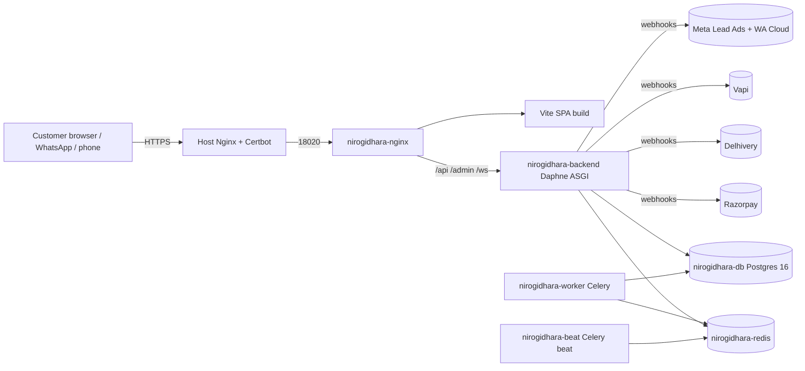
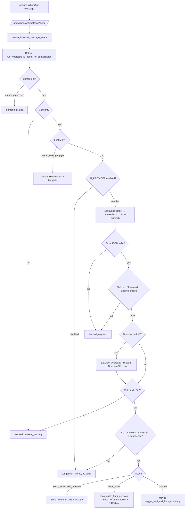
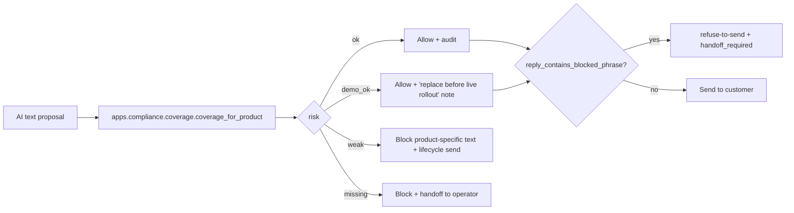
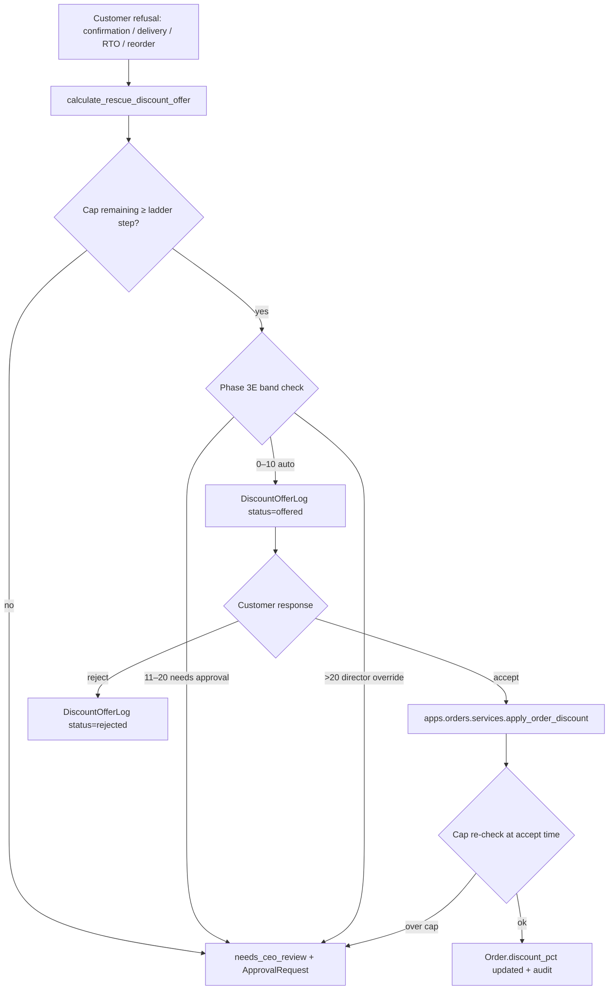
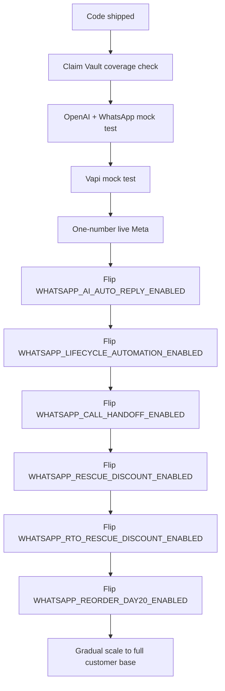

# Nirogidhara AI Command Center — Master Blueprint v2.0

**Subtitle:** Production Reality + AI Sales Automation + Compliance-Governed Revenue OS

---

## Document Control

| Field | Value |
| --- | --- |
| Version | v2.0 |
| Supersedes | Master Blueprint v1.0 (historical reference only — pre-Phase 5 design draft, kept for context, not for guidance) |
| Last revised | 2026-04-29 |
| Author of record | Prarit Sidana (Director, Nirogidhara Private Limited) |
| Production URL | https://ai.nirogidhara.com |
| Production status | LIVE — backend `/api/healthz/` returning OK |
| Completed phase range | Phase 1 → Phase 5E-Hotfix-2 |
| Last verified test baseline | 550 backend tests · 13 frontend tests · `makemigrations --check` clean · `manage.py check` clean · frontend lint 0 errors · build OK |
| Live deployment stack | Docker Compose (six containers) on Hostinger VPS, host port 18020 → host Nginx + Certbot SSL |
| GitHub repo | https://github.com/prarit0097/Nirogidhara-AI-Command-Center |
| VPS path | `/opt/nirogidhara-command` |
| Source of truth | [`nd.md`](../nd.md) — if any wording in this blueprint diverges from `nd.md`, `nd.md` wins. |

---

## 1. Vision & Purpose

Nirogidhara Private Limited sells Ayurvedic medicines across eight wellness categories (Weight Management, Blood Purification, Men Wellness, Women Wellness, Immunity, Lungs Detox, Body Detox, Joint Care) at a standard price of **₹3000 per 30 capsules** with a **₹499 fixed advance** payment.

Master Blueprint v1.0 framed the system as something we *would build*. v2.0 documents what *is built*: a single AI-run command centre that already replaces most of the spreadsheet + dialer + manual CRM stack, and gives Director Prarit a real-time governance surface to operate the company with a small human team.

**Primary KPI — never optimised away:**

```
Net Delivered Profit = Delivered Revenue
                       − Ad Cost
                       − Discount
                       − Courier Cost
                       − RTO Loss
                       − Payment Gateway Charges
                       − Product Cost
```

Reward and penalty are calculated against **delivered profitable orders**, not orders punched.

---

## 2. Current Production Reality

| Item | Value |
| --- | --- |
| Live URL | https://ai.nirogidhara.com |
| Backend health | `GET https://ai.nirogidhara.com/api/healthz/` → `200 OK` |
| Hosting | Hostinger VPS, shared with Postzyo + OpenClaw (isolated stack, dedicated namespace) |
| VPS folder | `/opt/nirogidhara-command` |
| Host port | `18020` → host Nginx 80/443 → Certbot SSL |
| Network | `nirogidhara_network` (isolated; never reuse Postzyo / OpenClaw volumes) |
| Compose project | `nirogidhara-command` |

### 2.1 Production containers

| Container | Role |
| --- | --- |
| `nirogidhara-db` | Postgres 16 (single-tenant). |
| `nirogidhara-redis` | Redis 7 (Celery broker DB 0/1; Channels DB 2). |
| `nirogidhara-backend` | Daphne ASGI for Django + DRF + Channels. Serves `/api/`, `/admin/`, `/ws/`. |
| `nirogidhara-worker` | Celery worker. WhatsApp send + AI orchestrator + reorder sweep + lifecycle dispatch. |
| `nirogidhara-beat` | Celery beat. Daily AI briefings (09:00 + 18:00 IST), Day-20 reorder sweep. |
| `nirogidhara-nginx` | Reverse proxy in front of Daphne; serves the Vite SPA bundle. |

Host Ubuntu Nginx + Certbot terminate TLS for `ai.nirogidhara.com` and forward to host port `18020`.

### 2.2 Operational reality

- All gateway integrations (Razorpay, Delhivery, Vapi, Meta Lead Ads, WhatsApp / Meta Cloud, AI provider) ship with `*_MODE=mock` / `disabled` so the first deploy never sends a live message.
- WhatsApp provider defaults to `mock`; live target is **Meta Cloud API** (`meta_cloud`). The Baileys provider exists but refuses to load when `DEBUG=False AND WHATSAPP_DEV_PROVIDER_ENABLED!=true` — dev/demo only.
- `.env.production` lives only on the VPS; it is gitignored and **never** committed.
- All automation feature flags (rescue discount, RTO rescue, Day-20 reorder, AI auto-reply, call handoff, lifecycle automation) default OFF in production.

### 2.3 Health check + deploy command summary

```bash
# After every git pull on the VPS:
cd /opt/nirogidhara-command
sudo docker compose -f docker-compose.prod.yml --env-file .env.production pull
sudo docker compose -f docker-compose.prod.yml --env-file .env.production up -d --build
sudo docker compose -f docker-compose.prod.yml --env-file .env.production exec backend python manage.py migrate
sudo docker compose -f docker-compose.prod.yml --env-file .env.production exec backend python manage.py makemigrations --check --dry-run
sudo docker compose -f docker-compose.prod.yml --env-file .env.production exec backend python manage.py seed_default_claims --reset-demo
sudo docker compose -f docker-compose.prod.yml --env-file .env.production exec backend python manage.py check_claim_vault_coverage
curl -fsS https://ai.nirogidhara.com/api/healthz/
```

---

## 3. Completed Build Timeline — Phase 1 → Phase 5E-Hotfix-2

| Phase | Status | What shipped | Risk / Safety note |
| --- | --- | --- | --- |
| 1 | ✅ Live | 14 Django apps, 25 read endpoints, JWT auth, role-based permissions, Master Event Ledger via signals, deterministic seed (42 leads, 60 orders, 18 calls, 19 agents). 21 frontend pages with mock fallback. | All reads only; mock fallback keeps frontend up offline. |
| 2A | ✅ Live | 14 write endpoints across CRM / orders / payments / shipments. Order state machine (`apps.orders.services.ALLOWED_TRANSITIONS`). Service-layer pattern. | Role-based writes; no auto-execution. |
| 2B | ✅ Live | Razorpay payment-link integration with `mock / test / live` adapter. HMAC-verified, idempotent webhook at `/api/webhooks/razorpay/`. ₹499 advance-link service. | `RAZORPAY_MODE=mock` default; live keys only on VPS. |
| 2C | ✅ Live | Delhivery courier integration (mock/test/live). HMAC-verified tracking webhook handles delivered / NDR / RTO transitions. | `DELHIVERY_MODE=mock` default. |
| 2D | ✅ Live | Vapi voice trigger (`POST /api/calls/trigger/`) + transcript ingest webhook. Persists transcript, summary, handoff flags. | `VAPI_MODE=mock` default. Vapi assistant prompt managed server-side in Vapi dashboard with Approved Claim Vault content. |
| 2E | ✅ Live | Meta Lead Ads ingest (`/api/webhooks/meta/leads/`). Three-mode adapter, idempotent on `leadgen_id`. | `META_MODE=mock` default. |
| 3A | ✅ Live | AgentRun foundation + AI provider adapters (`apps/integrations/ai/`). Approved-Claim-Vault-grounded prompt builder. CAIO hard stop. | `AI_PROVIDER=disabled` default; runs return `skipped` without network. |
| 3B | ✅ Live | Per-agent runtime services for CEO / CAIO / Ads / RTO / Sales Growth / CFO / Compliance. Admin-only `/api/ai/agent-runtime/*` endpoints. | All dry-run; no business writes. |
| 3C | ✅ Live | Celery beat at 09:00 + 18:00 IST. Provider fallback (OpenAI → Anthropic). Model-wise USD cost tracking. Scheduler Status page. | Eager mode default in dev; production uses Redis. |
| 3D | ✅ Live | AI Sandbox toggle, versioned prompts (rollback), per-agent USD budget guards, `/ai-governance` page. | PromptVersion content cannot bypass Approved Claim Vault. |
| 3E | ✅ Live | Catalog (ProductCategory / Product / SKU). Discount policy 10/20% bands. ₹499 fixed advance. Reward/penalty scoring formula. Approval matrix policy table. | Policy modules — no enforcement here; Phase 4C wires the engine. |
| 4A | ✅ Live | Real-time AuditEvent WebSockets via Django Channels. `/ws/audit/events/` carries full payload (no secrets). Dashboard "Live Activity" + Governance "Approval queue" auto-refresh. | Polling endpoints stay as fallback. |
| 4B | ✅ Live | Reward/Penalty Engine. AI-agents-only scoring with CEO AI net accountability. Idempotent `RewardPenaltyEvent` rows. Leaderboard + sweep endpoints. | CAIO excluded from business reward/penalty. Missing data is recorded, never invented. |
| 4C | ✅ Live | Approval Matrix Middleware enforcement. `ApprovalRequest` + `ApprovalDecisionLog` models. `enforce_or_queue` / `approve_request` / `reject_request`. CAIO refused at the bridge AND at the matrix evaluator. | Approval flips status only — execution still flows through tested service paths. |
| 4D | ✅ Live | Approved Action Execution Layer. `POST /api/ai/approvals/{id}/execute/` over a strict allow-listed handler registry (initial 3 actions). | Every other action returns HTTP 400 + `ai.approval.execution_skipped` audit. |
| 4E | ✅ Live | Execution registry expansion: `discount.up_to_10`, `discount.11_to_20`, `ai.sandbox.disable`. | `discount.above_20` + ad-budget + refund + WhatsApp + production-live-mode-switch remain unmapped → fail closed. |
| 5A-0 | ✅ Doc-only | WhatsApp compatibility audit + integration plan in `docs/WHATSAPP_INTEGRATION_PLAN.md`. Production target = Meta Cloud API; Baileys = dev/demo only. | None — pure design. |
| 5A-1 | ✅ Doc-only | WhatsApp AI Chat Agent + Discount Rescue Policy addendum (sections S–GG). Greeting rule locked, address collection in chat, category detection before product text, **AI never offers discount upfront**, **50% total discount cap**. | None — pure design. |
| 5A | ✅ Live | WhatsApp Live Sender Foundation. `apps.whatsapp` (8 models). Three providers (`mock` / `meta_cloud` / `baileys_dev`). Service layer gates consent + approved template + Claim Vault + approval matrix + CAIO + idempotency. Celery `send_whatsapp_message` task. Signed Meta webhook. 9 read + 4 write endpoints. `sync_whatsapp_templates` command. Settings → WABA section + read-only `/whatsapp-templates` page. | `WHATSAPP_PROVIDER=mock` default. Failed sends never mutate Order / Payment / Shipment. |
| 5A-Fix | ✅ Live | Env + docs consistency audit. Pure documentation sync. | No runtime change. |
| 5B | ✅ Live | Inbound WhatsApp Inbox + Customer 360 Timeline. `WhatsAppInternalNote` model. Six new endpoints. Six new audit kinds. Three-pane `/whatsapp-inbox` page. Customer 360 WhatsApp tab. | Manual-only; AI auto-reply / chat-to-call / rescue / order-from-chat all deferred. |
| 5B-Deploy | ✅ Live | Production Docker scaffold. `docker-compose.prod.yml`, multi-stage Dockerfiles, Nginx config, `.env.production.example`, full `docs/DEPLOYMENT_VPS.md`. Host port 18020:80. | All `*_MODE=mock` so first deploy never sends live. |
| 5B-Deploy Hotfix Sync | ✅ Live | Sync four manual VPS fixes back to repo: repo-root build context, explicit `deploy/backend/entrypoint.sh` copy + CRLF fix + `chmod +x`, no-args entrypoint default, duplicate-index recovery procedure documented. | Container / volume / network names + host port 18020 frozen. |
| 5C | ✅ Live | WhatsApp AI Chat Sales Agent. `apps.whatsapp.ai_orchestration.run_whatsapp_ai_agent` runs on every inbound (Celery). Hindi/Hinglish/English language detection. Locked Hindi greeting via approved UTILITY template. OpenAI dispatch. Strict JSON schema validator. Claim Vault grounding. Blocked-phrase filter. Discount discipline + 50% total cap. Order booking from chat + ₹499 advance link. Six new endpoints. 18 audit kinds. AI Chat Agent panel + AI Auto badge + Customer 360 status. | `WHATSAPP_AI_AUTO_REPLY_ENABLED=false` default. No medical-emergency replies. No freeform claims. No CAIO send. No shipment from chat. |
| 5D | ✅ Live | Chat-to-Call Handoff + Lifecycle Automation. `apps.whatsapp.call_handoff` is the single Vapi entry from WhatsApp; idempotent on `(conversation, inbound, reason)`. Safety reasons skip auto-dial. AI-booked orders move directly to confirmation queue. `apps.whatsapp.lifecycle` + `apps.whatsapp.signals` route Order/Payment/Shipment events to approved templates. Claim Vault coverage audit (`check_claim_vault_coverage`, `/api/compliance/claim-coverage/`). Three new endpoints. 11 new audit kinds. | `WHATSAPP_CALL_HANDOFF_ENABLED=false`, `WHATSAPP_LIFECYCLE_AUTOMATION_ENABLED=false`, `WHATSAPP_LIVE_META_LIMITED_TEST_MODE=true` defaults. |
| 5E | ✅ Live | Rescue Discount Flow + Day-20 Reorder + Default Claim Vault Seeds. `apps.orders.rescue_discount` enforces the **50% absolute cumulative cap** with per-stage ladders. `DiscountOfferLog` records every attempt. CEO AI / admin escalation via `discount.rescue.ceo_review` + `discount.above_safe_auto_band` matrix rows. Five new endpoints. 12 new audit kinds. `seed_default_claims` covers the eight categories. | `WHATSAPP_RESCUE_DISCOUNT_ENABLED=false`, `WHATSAPP_RTO_RESCUE_DISCOUNT_ENABLED=false`, `WHATSAPP_REORDER_DAY20_ENABLED=false`, `DEFAULT_CLAIMS_SEED_DEMO_ONLY=true` defaults. CAIO refused at offer entry. |
| 5E-Hotfix | ✅ Live | Two `RenameIndex` migrations to bring Phase 5D / 5E hand-rolled index names in line with Django's auto-suffix form. Working agreement now requires `python manage.py makemigrations --check --dry-run` to be clean before every commit. | Pure metadata; no schema rewrite. |
| 5E-Hotfix-2 | ✅ Live | Strengthened demo Claim Vault seed. Four universal safe usage-guidance phrases merged into every demo entry. `USAGE_HINT_KEYWORDS` widened. Demo marker bumped to `version="demo-v2"`. After `--reset-demo`, all 8 categories report `risk=demo_ok` (not `weak`). Real admin / doctor-approved claims still never overwritten. | Production still requires real doctor-approved final claims before full live rollout. Automation flags remain OFF until controlled mock + OpenAI testing passes. |

---

## 4. Architecture (the contract)

```
React UI  ──/api/ JSON──►  Django + DRF  ──ORM──►  Postgres (prod) / SQLite (dev)
   │                          │
   │                          │ post_save signals + service-layer writes
   │                          ▼
   │                   audit.AuditEvent  ← Master Event Ledger
   │                          ▲
   │                          │
   │                  Razorpay / Delhivery / Vapi / Meta / WhatsApp webhooks
   │                  (HMAC-verified, idempotent)
   │
   └── mock fallback ── frontend/src/services/mockData.ts (offline-safe)
```

**Frontend → backend** flows through one file: `frontend/src/services/api.ts`. Every page consumes `api`; no page imports `mockData.ts` directly. JSON keys are camelCase; DB columns stay snake_case (mapped via DRF `source=`).

**Backend → frontend** real-time uses Django Channels at `/ws/audit/events/`. The frame carries the full stored `AuditEvent.payload` — but no secrets in audit payloads (existing rule).

**Workflow logic lives in `apps/<app>/services.py`** — views are parse → call service → respond.

**Gateway integrations live in `apps/<app>/integrations/`** with mock/test/live mode dispatch. Failed integration calls **never** mutate `Order` / `Payment` / `Shipment`.

---

## 5. Locked Business Rules

| Rule | Value |
| --- | --- |
| Standard price | ₹3000 per 30-capsule pack |
| Advance payment | ₹499 fixed (`apps.payments.policies.FIXED_ADVANCE_AMOUNT_INR`) |
| AI never offers discount upfront | Hard rule; first customer ask = objection handling, not discount |
| Minimum customer pushes before AI may surface a discount | 2–3 (`MIN_OBJECTION_TURNS_BEFORE_OFFER`) |
| Refusal-based rescue stages | (A) order-booking refusal · (B) confirmation refusal · (C) delivery / RTO refusal |
| Per-stage rescue ladder | Confirmation 5 / 10 / 15 · Delivery 5 / 10 · RTO 10 / 15 / 20 (high-risk step-up) · Reorder 5 |
| Cumulative discount hard cap | **50% absolute** across ALL stages on a single order |
| Over-cap or above-auto-band | Auto-mints `ApprovalRequest` via `discount.rescue.ceo_review` (CEO AI / admin) or `discount.above_safe_auto_band` (director-only) |
| Acceptance applies through | `apps.orders.services.apply_order_discount` only — no other module mutates `Order.discount_pct` |
| AI-booked orders | Move directly to **Confirmation Pending** via `apps.orders.services.move_to_confirmation` |
| Reorder cadence | **Day 20** after delivery (window 20–27 days). No upfront discount; opens only on objection. |
| Chat-to-call handoff | Vapi triggered directly through `apps.calls.services.trigger_call_for_lead`. Safety reasons (medical_emergency / side_effect_complaint / legal_threat / refund_threat) record a `skipped` row for human / doctor pickup — never auto-dial sales. |
| No shipment from chat | The AI Chat Agent never creates `apps.shipments` rows. |

---

## 6. Master Blueprint v2.0 Final Locked Non-Negotiables

The following are non-negotiable and apply to every contributor, every AI agent, every code change, every deploy:

1. **Django + DRF API-first.** Every business operation is a service; views parse + call services + respond.
2. **Frontend holds zero business logic.** Pages render API responses and dispatch typed payloads. `services/api.ts` is the only HTTP edge.
3. **Backend services own all execution.** No third-party SDK is invoked from a view; gateway adapters live in `apps/<app>/integrations/`.
4. **Approved Claim Vault is mandatory.** Every medical / product explanation must come from `apps.compliance.Claim`. Hard-coded medical strings are forbidden.
5. **CAIO never executes customer-facing actions.** It monitors / audits / suggests only — refused at the matrix evaluator, the AgentRun bridge, the WhatsApp service entry, the rescue discount creator, and the execute layer.
6. **CEO AI / Approval Matrix is the execution approval layer** for low / medium-risk actions. Director (Prarit) is final authority for high-risk decisions (ad budgets, refunds, new claims, emergencies, live-mode flips).
7. **50% total discount cap is an absolute hard limit.** Never bypassed. Over-cap requests always escalate.
8. **No shipment from chat.** Period.
9. **No campaigns, no refunds, no ad-budget execution from any AI agent.** These are explicitly unmapped in the Phase 4D execution registry — fail closed with `ai.approval.execution_skipped`.
10. **Every critical event is audited.** Master Event Ledger (`audit.AuditEvent`) is append-only; every state change writes one row; secrets never enter payloads.
11. **Migration drift gate is mandatory.** `python manage.py makemigrations --check --dry-run` MUST report `No changes detected` before every commit and on every VPS deploy.
12. **Feature flags default OFF.** Rescue / reorder / handoff / lifecycle / auto-reply automation defaults to safe-OFF until controlled mock + OpenAI verification passes.
13. **Production fixes must be synced back** to GitHub `main` and to `nd.md` immediately; the VPS folder mirrors `origin/main` at the end of every working session.
14. **Never commit secrets.** `.env`, `.env.production`, `db.sqlite3`, real keys — never. The `.gitignore` covers them; `git diff --cached` review is mandatory pre-push.
15. **Prarit Sidana is final authority.** Every high-risk decision (ad budget changes, refunds, new medical claims, customer messaging campaigns, kill-switch states, production live-mode switches) requires explicit director sign-off.

---

## 7. Repo & Stack

### 7.1 Stack

| Layer | Technology |
| --- | --- |
| Frontend | React 18 · Vite · TypeScript · Tailwind · shadcn UI · TanStack Query · Vitest |
| Backend | Django 5 · DRF · Django Channels · Daphne ASGI · simple-jwt |
| Database | Postgres 16 (production) · SQLite (dev) |
| Cache / broker | Redis 7 (Celery DBs 0/1, Channels DB 2) |
| Async runtime | Celery worker + Celery beat |
| AI providers | OpenAI primary, Anthropic fallback (configurable via `AI_PROVIDER_FALLBACKS`) |
| Voice | Vapi (mock / test / live mode adapter) |
| Courier | Delhivery (mock / test / live) |
| Payments | Razorpay (mock / test / live), PayU (mock-only) |
| Lead source | Meta Lead Ads webhook (mock / test / live) |
| WhatsApp | Meta Cloud API (`meta_cloud`), `mock` default, `baileys_dev` for dev only |
| Container runtime | Docker Compose (production) |
| Web server | Nginx (container) behind host Ubuntu Nginx + Certbot SSL |

### 7.2 Repo layout (canonical paths)

```
nirogidhara-command/
├── README.md                         # Quickstart + docs index
├── nd.md                             # Project handoff — source of truth
├── CLAUDE.md / AGENTS.md             # AI agent guardrails
├── .env.production.example           # Production env template (real .env.production never committed)
├── docker-compose.prod.yml           # Production stack
├── deploy/                           # Nginx config + entrypoint.sh
├── frontend/                         # React 18 + Vite + TS
│   ├── Dockerfile                    # multi-stage node → nginx alpine
│   └── src/
│       ├── services/api.ts           # the only HTTP edge
│       ├── types/domain.ts           # 1:1 with Django serializers
│       ├── pages/                    # 21 routes
│       └── test/                     # 13 vitest tests
├── backend/                          # Django 5 + DRF + Channels
│   ├── Dockerfile                    # python:3.11-slim + tini + non-root
│   ├── apps/                         # 16 apps (see §8 module catalogue)
│   ├── config/                       # settings.py / urls.py / asgi.py / routing.py / celery.py
│   └── tests/                        # 550 pytest cases
└── docs/
    ├── MASTER_BLUEPRINT_V2.md        # ← this file (current strategic blueprint)
    ├── RUNBOOK.md
    ├── DEPLOYMENT_VPS.md
    ├── BACKEND_API.md
    ├── FRONTEND_AUDIT.md
    ├── FUTURE_BACKEND_PLAN.md
    └── WHATSAPP_INTEGRATION_PLAN.md
```

---

## 8. Module Catalogue

### 8.1 Already built (live in production)

| Module | Code home | Surface |
| --- | --- | --- |
| CRM + Customer 360 | `apps.crm` | Lead, Customer, Meta Lead Ads ingest. Customer 360 page with WhatsApp tab (Phase 5B). |
| Orders & State Machine | `apps.orders` | `Order` model, `services.ALLOWED_TRANSITIONS`, confirmation queue, RTO board, `apply_order_discount`. Phase 5E adds `DiscountOfferLog` + `rescue_discount`. |
| Payments | `apps.payments` | Razorpay payment links, ₹499 advance policy (`FIXED_ADVANCE_AMOUNT_INR`), HMAC-verified webhooks. |
| Shipments / Delhivery | `apps.shipments` | `Shipment` + `WorkflowStep`. Delhivery tracking webhook sets delivered / NDR / RTO. |
| Calls / Vapi | `apps.calls` | `Call`, `ActiveCall`, `CallTranscriptLine`, `WebhookEvent`. `trigger_call_for_lead` is the single entry. |
| AI Governance | `apps.ai_governance` | AgentRun, PromptVersion, SandboxState, AgentBudget, ApprovalRequest, ApprovalDecisionLog, ApprovalExecutionLog, approval engine, approval execution layer. |
| AI Provider adapters | `apps.integrations.ai` | OpenAI / Anthropic / Grok dispatchers, fallback chain, model-wise USD pricing. |
| CEO AI / CAIO runtimes | `apps.ai_governance.services.agents` | Per-agent runtimes for CEO / CAIO / Ads / RTO / Sales Growth / CFO / Compliance. |
| Reward / Penalty engine | `apps.rewards` | `RewardPenaltyEvent`, scoring, leaderboard, sweep endpoints + Celery task. |
| Compliance / Claim Vault | `apps.compliance` | `Claim` model, `coverage.py`, `seed_default_claims`, `check_claim_vault_coverage`, coverage endpoint. |
| Catalog | `apps.catalog` | `ProductCategory`, `Product`, `ProductSKU`. |
| Real-time AuditEvent | `apps.audit` | `AuditEvent`, signal receivers, Channels publisher, `/ws/audit/events/`. |
| WhatsApp app | `apps.whatsapp` | 10 models, three providers, signed webhook, AI Chat Sales Agent, Inbox, Customer 360 timeline, Lifecycle service, Day-20 reorder service, Call handoff service. |

### 8.2 Currently safe but OFF by feature flag

| Capability | Flag | Default |
| --- | --- | --- |
| WhatsApp AI auto-reply | `WHATSAPP_AI_AUTO_REPLY_ENABLED` | `false` |
| WhatsApp → Vapi handoff (auto) | `WHATSAPP_CALL_HANDOFF_ENABLED` | `false` |
| Lifecycle automation (signal-driven sends) | `WHATSAPP_LIFECYCLE_AUTOMATION_ENABLED` | `false` |
| Confirmation + delivery rescue discount | `WHATSAPP_RESCUE_DISCOUNT_ENABLED` | `false` |
| RTO rescue discount (auto via WhatsApp / AI Call) | `WHATSAPP_RTO_RESCUE_DISCOUNT_ENABLED` | `false` |
| Day-20 reorder reminder cadence | `WHATSAPP_REORDER_DAY20_ENABLED` | `false` |
| Limited live-Meta test mode | `WHATSAPP_LIVE_META_LIMITED_TEST_MODE` | `true` (only test numbers can receive live sends until flipped) |

### 8.3 Needs controlled testing before live rollout

- Live Meta WhatsApp Cloud API sends to real customer numbers.
- Live Vapi voice calls (only mock + test verified today).
- AI auto-reply on a real customer thread (must soak with `WHATSAPP_LIVE_META_LIMITED_TEST_MODE=true` first).
- Lifecycle automation on real Order/Payment/Shipment events.
- Day-20 reorder sweep against real delivered orders.

### 8.4 Future roadmap (planned but not built)

- Phase 5F — approval-gated broadcast / sales campaigns (MARKETING tier templates, director sign-off).
- Phase 6 — Recording / QA / learning loop pipeline (speech-to-text → compliance → CAIO audit → sandbox → live promotion).
- Phase 7 — Multi-tenant SaaS readiness; Android / iOS apps hitting the same backend.

---

## 9. WhatsApp AI Sales + Lifecycle Engine

WhatsApp is the cornerstone of the v2.0 sales funnel. The engine has six surfaces:

### 9.1 WhatsApp Inbox (`/whatsapp-inbox`)

Three-pane operator UI: filters / conversation list / thread + internal notes + manual template send modal. Live refresh via Phase 4A `connectAuditEvents` filtered on `whatsapp.*`. Six API endpoints under `/api/whatsapp/inbox/`, `/conversations/{id}/...`. Operator actions: assign, mark read, internal note, manual template send (routed through Phase 5A `queue_template_message` so consent + Claim Vault + matrix + CAIO + idempotency stay in force).

### 9.2 Customer 360 WhatsApp tab

Surfaced inside the existing Customer 360 page. Shows the customer's WhatsApp timeline (messages + status events + internal notes) interleaved by event timestamp, plus the live AI status pill (`auto / suggest / disabled / auto_reply_off / provider_disabled`).

### 9.3 AI Chat Sales Agent

`apps.whatsapp.ai_orchestration.run_whatsapp_ai_agent` runs on every inbound (Celery `run_whatsapp_ai_agent_for_conversation`). Pipeline:

1. **Idempotency check** on the inbound message id.
2. **Consent gate** + AI-enabled gate (per-conversation toggle).
3. **Language detection** — deterministic Hindi / Hinglish / English via Devanagari ratio + Hinglish marker words. Stamps `WhatsAppConversation.metadata.detectedLanguage`.
4. **Greeting fast-path** — first reply on a new thread sends the locked Hindi UTILITY template `"Namaskar, Nirogidhara Ayurvedic Sanstha mein aapka swagat hai..."`. Fail-closed if missing — never freestyle a greeting.
5. **AI provider gate** — `AI_PROVIDER=disabled` → suggestion stored, no auto-send.
6. **Context build** — recent messages + Customer 360 + last order + Claim Vault for the detected category.
7. **Prompt build + dispatch** via `apps.integrations.ai.dispatch.dispatch_messages`.
8. **Strict JSON schema validation** (`apps.whatsapp.ai_schema.parse_decision`). Schema failure → handoff.
9. **Safety gates** — medical emergency / side-effect complaint / legal threat / angry-customer / Claim Vault not used / blocked-phrase filter (`reply_contains_blocked_phrase`).
10. **Discount discipline** — `evaluate_whatsapp_discount` enforces 2–3 push minimum + 50% cumulative cap. Any discount also writes a `DiscountOfferLog` row.
11. **Rate limit gate** — `WHATSAPP_AI_MAX_TURNS_PER_CONVERSATION_PER_HOUR` + `WHATSAPP_AI_MAX_MESSAGES_PER_CUSTOMER_PER_DAY`.
12. **Confidence + auto-send config** — `WHATSAPP_AI_AUTO_REPLY_ENABLED` + `WHATSAPP_AI_AUTO_REPLY_CONFIDENCE_THRESHOLD`.
13. **Action dispatch** — `send_reply` / `ask_question` / `book_order` / `handoff`.

### 9.4 Auto language detection

| Customer language | AI reply language |
| --- | --- |
| Hindi (Devanagari ratio ≥ threshold) | Hindi |
| Hinglish (Latin script + Hinglish markers like `bhai`, `kya`, `karo`, …) | Hinglish |
| English (no Devanagari, no Hinglish markers) | English |

### 9.5 Locked greeting rule

The first reply to any generic intro on a fresh conversation MUST be the Meta-approved UTILITY template tagged `whatsapp.greeting`. The Hindi locked phrase is reserved verbatim. If the template is missing or inactive, the agent writes `whatsapp.ai.greeting_blocked` and refuses to freestyle.

### 9.6 Category detection → Claim-Vault-grounded explanation

The agent identifies a `apps.catalog.ProductCategory` slug *before* any product-specific text. Once the category is known, product explanations may only quote from `apps.compliance.Claim.approved` for that product. The Phase 5D Claim Vault coverage gate fails closed if the relevant product has no approved claims (only demo seeds exist today; production needs doctor-approved replacements).

### 9.7 Address collection in chat

Stateful via `WhatsAppConversation.metadata.address_collection`. Required fields: customerName, phone, address, pincode, city, state. Order booking refuses if incomplete.

### 9.8 Order booking from chat

`apps.whatsapp.order_booking.book_order_from_decision`:

- Validates the order draft is complete.
- Validates the discount via Phase 5E `validate_total_discount_cap`.
- Calls `apps.orders.services.create_order` (existing service path — never bypassed).
- Phase 5D: immediately calls `apps.orders.services.move_to_confirmation` so the AI-booked order lands in the **Confirmation Pending** queue.
- Optionally calls `apps.payments.services.create_payment_link` for the **₹499 advance link** (uses `FIXED_ADVANCE_AMOUNT_INR`).
- **Never** touches `apps.shipments`. No dispatch from chat.

### 9.9 ₹499 advance payment link

Created via `apps.payments.services.create_payment_link` whenever the LLM marks `payment.shouldCreateAdvanceLink=true`. The link goes into the next outbound message; failure to create the link does NOT roll back the booked order — metadata flips `paymentLinkPending=true` instead.

### 9.10 AI Auto badge + AI Agent panel

Frontend (`/whatsapp-inbox`):

- Outbound bubbles with `aiGenerated=true` show an "AI Auto" badge.
- The right pane carries an `AiAgentPanel` with: mode toggle, language pill, category pill, confidence pill, handoff banner, order-booked card, last-suggestion preview, **Run AI / Handoff / Resume / Disable / Call customer** buttons, and (Phase 5E) a **Rescue Discount cap card** showing current cumulative %, cap remaining out of 50%, and customer ask count.

### 9.11 Direct Vapi handoff

`apps.whatsapp.call_handoff.trigger_vapi_call_from_whatsapp` is the SINGLE entry that may dial Vapi from a WhatsApp conversation. Routes through `apps.calls.services.trigger_call_for_lead` — never the adapter directly. Idempotent on `(conversation, inbound_message, reason)` via the `WhatsAppHandoffToCall` model. Operator manual trigger lives at `POST /api/whatsapp/conversations/{id}/handoff-to-call/`. Safety reasons (medical_emergency / side_effect_complaint / legal_threat / refund_threat) are recorded as `skipped` for human / doctor pickup — never auto-dial sales.

### 9.12 Lifecycle messages

`apps.whatsapp.lifecycle.queue_lifecycle_message` + `apps.whatsapp.signals` listen on Order/Payment/Shipment `post_save` and route business events to approved templates:

| Event | Template action key |
| --- | --- |
| Order moved to Confirmation Pending | `whatsapp.confirmation_reminder` |
| Payment link created (Pending) | `whatsapp.payment_reminder` |
| Shipment Out for Delivery | `whatsapp.delivery_reminder` |
| Shipment Delivered | `whatsapp.usage_explanation` (fails closed if Claim Vault `missing` / `weak`) |
| Shipment NDR | `whatsapp.rto_rescue` |
| Shipment RTO Initiated | `whatsapp.rto_rescue` |
| Confirmation refusal | `whatsapp.confirmation_rescue_discount` |
| Delivery refusal | `whatsapp.delivery_rescue_discount` |
| RTO risk / refusal | `whatsapp.rto_rescue_discount` |
| Day-20 reorder | `whatsapp.reorder_day20_reminder` |

Idempotent on `lifecycle:{action}:{type}:{id}:{event}`.

### 9.13 Rescue discounts

See §11. The lifecycle layer surfaces the rescue templates; the math + cap + CEO escalation live in `apps.orders.rescue_discount`.

### 9.14 Day-20 reorder reminder

See §12.

---

## 10. AI Calling (Vapi)

The Vapi voice agent is wired and live in `mock` mode. The full pipeline:

| Element | Status |
| --- | --- |
| `POST /api/calls/trigger/` (manual + lead-driven) | ✅ Live, mock mode default. |
| Vapi adapter (`apps.calls.integrations.vapi_client`) | ✅ Live, mock / test / live modes. |
| Webhook ingest (`/api/webhooks/vapi/`) | ✅ Live, HMAC-verified. Persists transcript, summary, handoff flags. |
| WhatsApp → Vapi handoff (Phase 5D) | ✅ Live, gated by `WHATSAPP_CALL_HANDOFF_ENABLED`. |
| Safety reasons skip auto-dial | ✅ Live (medical_emergency / side_effect / legal_threat / refund_threat → `skipped` row, human pickup). |
| Claim Vault grounded prompts | ✅ Server-side in Vapi dashboard. The adapter injects no medical content; only metadata (lead id, language, purpose). |

The AI Calling Agent assists rescue, confirmation, RTO, and sales. It uses the same locked discount discipline + 50% cap as the WhatsApp AI Chat Agent (any discount accepted on a Vapi call is recorded via `DiscountOfferLog` with `source_channel=ai_call`). All flows route through `apps.calls.services.trigger_call_for_lead`; no view ever calls the Vapi adapter directly. Production live rollout still requires controlled mock + test verification — the live flag is gated behind director sign-off.

---

## 11. Discount Rules & Rescue Discount Engine

### 11.1 Locked rules

| Rule | Value |
| --- | --- |
| Standard price | ₹3000 / 30 capsules |
| Advance | ₹499 fixed |
| AI never offers discount upfront | Hard rule |
| First customer ask | Objection handling (value / trust / benefit / brand / doctor / ingredients / lifestyle) |
| Eligible to surface a discount | After 2–3 customer pushes OR refusal-based rescue trigger |
| Confirmation rescue ladder | 5 / 10 / 15 |
| Delivery rescue ladder | 5 / 10 |
| RTO rescue ladder | 10 / 15 / 20 (high-risk steps up by one) |
| Reorder rescue ladder | 5 |
| Cumulative cap | **50% absolute** across ALL stages on a single order |
| Above auto band (>10%) | Requires CEO AI / admin approval |
| Above safe band (>20%) | Requires director override |
| Above 50% cumulative | Auto-mints `discount.rescue.ceo_review` `ApprovalRequest`; status flips to `needs_ceo_review` |
| Acceptance applies through | `apps.orders.services.apply_order_discount` only |
| Cap re-validated at accept time | Yes — over-cap at accept flips to `needs_ceo_review` instead of mutating the order |

### 11.2 DiscountOfferLog

Append-only `apps.orders.DiscountOfferLog` records every offer attempt with: `order` · `customer` · `conversation` · `source_channel (whatsapp_ai / ai_call / confirmation / delivery / rto / operator / system)` · `stage (order_booking / confirmation / delivery / rto / reorder / customer_success)` · `trigger_reason` · `previous_discount_pct` · `offered_additional_pct` · `resulting_total_discount_pct` · `cap_remaining_pct` · `status (offered / accepted / rejected / blocked / skipped / needs_ceo_review)` · `blocked_reason` · `offered_by_agent` · `approval_request` (FK) · `metadata`.

Audit kinds: `discount.offer.{created,sent,accepted,rejected,blocked,needs_ceo_review}`.

### 11.3 CEO AI escalation

When the rescue calculator returns `needs_ceo_review` (cap exhausted, above auto band, or AI uncertain), the engine calls `apps.ai_governance.approval_engine.enforce_or_queue` with action `discount.rescue.ceo_review` (CEO AI / admin) or `discount.above_safe_auto_band` (director-only). The created `ApprovalRequest` is linked back to the offer via `DiscountOfferLog.approval_request`. CAIO is refused at the rescue creator entry — it can never originate or apply a customer-facing discount.

### 11.4 Endpoints

| Method | Path | Purpose |
| --- | --- | --- |
| GET | `/api/orders/{id}/discount-offers/` | List offers + cap snapshot. |
| POST | `/api/orders/{id}/discount-offers/rescue/` | Operator manual rescue trigger (operations+). |
| POST | `/api/orders/{id}/discount-offers/{offer_id}/accept/` | Customer accepted — applies via service layer. |
| POST | `/api/orders/{id}/discount-offers/{offer_id}/reject/` | Customer rejected — records, never mutates Order. |

---

## 12. Reorder Engine (Day-20)

| Item | Detail |
| --- | --- |
| Cadence | Day-20 after delivery (eligibility window 20–27 days). |
| No upfront discount | Day-20 reminder is a normal reorder template. Discount opens only on objection. |
| Eligibility | `Order.stage == "Delivered"` · `created_at` within 20–27 days · WhatsApp consent · approved template · Claim Vault `ok` / `demo_ok` · not already reminded. |
| Idempotency key | `lifecycle:whatsapp.reorder_day20_reminder:order:{id}:day20`. |
| Trigger surface | `apps.whatsapp.reorder.run_day20_reorder_sweep` + `python manage.py run_reorder_day20_sweep` + Celery `run_reorder_day20_sweep_task` (intended for daily Celery beat once `WHATSAPP_REORDER_DAY20_ENABLED=true`). |
| Admin endpoints | `GET /api/whatsapp/reorder/day20/status/`, `POST /api/whatsapp/reorder/day20/run/`. |
| Rollout | Controlled mock + OpenAI verification first; flip flag only after Phase 5E coverage report shows no `weak` rows for the active categories. |

---

## 13. Claim Vault & Compliance

The Claim Vault (`apps.compliance.Claim`) is the **central compliance gate** for every product / medical statement the AI may emit.

### 13.1 What the Claim Vault enforces

- Every medical / product explanation that any AI agent emits — WhatsApp Chat, Vapi voice, lifecycle template body, AgentRun output — must be grounded in `Claim.approved` for the relevant product.
- Free-style medical claims are forbidden. Hard-coded medical strings are forbidden.
- Every blocked phrase below MUST never appear in any AI output:
  - `Guaranteed cure`
  - `Permanent solution`
  - `No side effects for everyone`
  - `Doctor ki zarurat nahi`
  - `Works for everyone`
  - `100% cure`
  - `Replaces all medication`
  - Emergency medical advice

### 13.2 Coverage classification

`apps.compliance.coverage` classifies each product into one of four risk levels:

| Risk | Meaning |
| --- | --- |
| `ok` | At least one approved phrase + at least one usage / lifecycle keyword present. Real doctor-approved row. |
| `demo_ok` | Same, but the row is a demo seed (`Claim.version="demo-v1"` or `demo-v2`). Surfaces with a "replace before live rollout" note. |
| `weak` | Approved list non-empty but no usage / lifecycle keyword found. Limits automation. |
| `missing` | No `Claim` row exists for the product / category. Blocks product-specific automation. |

`weak` and `missing` are blocking signals for the lifecycle `whatsapp.usage_explanation` template and any product-specific freeform AI text.

### 13.3 Demo / default seed system

- `python manage.py seed_default_claims` is idempotent. It seeds eight categories (Weight Management, Blood Purification, Men Wellness, Women Wellness, Immunity, Lungs Detox, Body Detox, Joint Care) with conservative non-cure phrases.
- Demo rows are flagged with `Claim.version="demo-v2"` + `Claim.doctor="Demo Default"` + `Claim.compliance="Demo Default"`.
- Phase 5E-Hotfix-2 added four universal safe usage phrases to every demo entry:
  - "Use only as directed on the product label or as advised by a qualified practitioner."
  - "Maintain hydration, balanced diet, and regular routine while using this wellness product."
  - "For pregnancy, ongoing illness, severe symptoms, allergies, or existing medication, consult a qualified doctor before use."
  - "Discontinue use and seek professional advice if any discomfort or unusual reaction occurs."
- `--reset-demo` upgrades `demo-v1` rows to `demo-v2`. Real admin / doctor-approved rows are NEVER overwritten.

### 13.4 Demo claims are NOT final medical claims

Demo seeds exist to unblock dev / mock / OpenAI testing. **Production live rollout requires real doctor-approved claims** for every product the AI will discuss with real customers. Until those land:

- `risk=demo_ok` rows surface in the coverage report with the note `"demo default claim; replace with doctor-approved final claim before full live rollout"`.
- The `whatsapp.usage_explanation` lifecycle template still works on demo seeds in mock mode but should not be promoted to live Meta until the product's claim row has been replaced by a doctor-approved entry.
- Blood Purification and Lungs Detox specifically may still need real doctor-approved usage hints if the existing production rows are protected real-admin entries that pre-date the demo-v2 strengthening.

### 13.5 Coverage tooling

- Service: `apps.compliance.coverage.build_coverage_report` / `coverage_for_product`.
- Command: `python manage.py check_claim_vault_coverage [--strict-weak] [--json]`. Exits 1 on `missing`; with `--strict-weak`, exits 1 on `weak` too.
- Endpoint: `GET /api/compliance/claim-coverage/` (admin / director only). Writes a single `compliance.claim_coverage.checked` audit per call.

---

## 14. Approval Matrix & Governance

### 14.1 Implemented

| Component | Implementation |
| --- | --- |
| Approval Matrix Middleware | `apps.ai_governance.approval_engine.enforce_or_queue` is the single source of truth for "may this action proceed right now?". |
| `ApprovalRequest` | Full lifecycle (pending / auto_approved / approved / rejected / blocked / escalated / expired) + status snapshot of the matrix policy at request time. |
| `ApprovalDecisionLog` | One row per status transition; never silently overwrites history. |
| `ApprovalExecutionLog` | One row per executed approval, idempotent re-execute returns prior result. |
| Execute endpoint | `POST /api/ai/approvals/{id}/execute/` over a strict allow-listed handler registry. |
| Allow-listed registry | `payment.link.advance_499`, `payment.link.custom_amount`, `ai.prompt_version.activate`, `discount.up_to_10`, `discount.11_to_20`, `ai.sandbox.disable`. Every other action returns HTTP 400 + `ai.approval.execution_skipped` audit. |
| CAIO blocked at multiple layers | Engine evaluator + AgentRun bridge + execute layer + WhatsApp service entry + rescue discount creator. |
| Sandbox toggle | `apps.ai_governance.sandbox.SandboxState` singleton. CEO success runs cannot refresh live `CeoBriefing` while sandbox is enabled. |
| Prompt versioning | `PromptVersion` with one-click rollback. Content cannot bypass the Approved Claim Vault. |
| Per-agent USD budgets | `AgentBudget` with warning threshold + block. Budget breach never silently triggers fallback. |
| AI kill switch / flags | Director-only `ai.sandbox.disable` + `ai.production.live_mode_switch` (matrix `director_override`). |
| No autonomous high-risk execution | Discounts > 20%, ad-budget changes, refunds, WhatsApp campaigns, production live-mode flips → all unmapped or director-only. |

### 14.2 Phase 5E additions

Two new matrix rows for AI rescue discount escalation:

| Action | Approver | Mode |
| --- | --- | --- |
| `discount.rescue.ceo_review` | `ceo_ai` | `approval_required` |
| `discount.above_safe_auto_band` | `director` | `director_override` |

---

## 15. Reward / Penalty Engine

`apps.rewards` ships the Phase 4B engine that wires the Phase 3E pure formula into per-order, per-AI-agent `RewardPenaltyEvent` rows.

| Property | Value |
| --- | --- |
| Scope | **AI agents only.** Human callers are not scored here. |
| CEO AI net accountability | Every delivered order writes a CEO AI reward row; every RTO / cancelled order writes a CEO AI penalty row. |
| Idempotency | `RewardPenaltyEvent.unique_key` constraint. |
| Leaderboard | Aggregated rollup per agent. Surfaced on the `/rewards` page. |
| Order-wise events | Visible on the same page; supports filter by agent / order / event type. |
| Sweep | `python manage.py calculate_reward_penalties [--order-id] [--dry-run]` + `apps.rewards.tasks.run_reward_penalty_sweep_task`. |
| Endpoints | `GET /api/rewards/{,events,summary,sweep}/` (admin / director). |
| CAIO | **Excluded** from business reward/penalty scoring. |
| Missing data | Recorded with a `missing_data` note; never invented. The scoring formula refuses to estimate the absent term. |

---

## 16. Real-Time / Audit / WebSockets

| Component | Implementation |
| --- | --- |
| Channel layer | Django Channels. Local dev uses in-memory layer; production uses Redis backend at DB index 2. |
| WebSocket route | `ws://<host>/ws/audit/events/`. |
| Frame | Full stored `AuditEvent.payload` — but never put secrets in audit payloads. |
| Publisher | `apps.audit.realtime.publish_audit_event`, wrapped in `transaction.on_commit` and broad try/except — a missing Redis NEVER breaks a service-layer write. |
| Frontend client | `frontend/src/services/realtime.ts` — derives WS origin from `VITE_API_BASE_URL` (or `VITE_WS_BASE_URL` override), reconnects with exponential backoff, deduplicates by id. |
| Live surfaces | Dashboard "Live Activity" feed, Governance "Approval queue", WhatsApp Inbox (filtered on `whatsapp.*`). |
| Fallback | Polling endpoints (`/api/dashboard/activity/`, `/api/ai/approvals/`, `/api/whatsapp/lifecycle-events/`) remain so the app degrades gracefully if the WS connection drops. |
| Consumer | Read-and-fanout only. Never executes business writes. |

---

## 17. Automation Feature Flags & Safe Rollout

### 17.1 The flags

| Flag | Default | Controls |
| --- | --- | --- |
| `WHATSAPP_AI_AUTO_REPLY_ENABLED` | `false` | Phase 5C — AI auto-reply on inbound WhatsApp messages. When `false`, the AI stores a suggestion but ops must click Send. |
| `WHATSAPP_CALL_HANDOFF_ENABLED` | `false` | Phase 5D — opportunistic Vapi dial from the WhatsApp AI orchestrator on safe handoff reasons. |
| `WHATSAPP_LIFECYCLE_AUTOMATION_ENABLED` | `false` | Phase 5D — signal-driven approved-template sends on Order/Payment/Shipment events. |
| `WHATSAPP_RESCUE_DISCOUNT_ENABLED` | `false` | Phase 5E — confirmation + delivery rescue discount offers. |
| `WHATSAPP_RTO_RESCUE_DISCOUNT_ENABLED` | `false` | Phase 5E — RTO automatic rescue discount via WhatsApp / AI Call. |
| `WHATSAPP_REORDER_DAY20_ENABLED` | `false` | Phase 5E — Day-20 reorder reminder cadence. |
| `WHATSAPP_LIVE_META_LIMITED_TEST_MODE` | `true` | Phase 5D safety bridge — when WhatsApp is on Meta Cloud and this flag is true, sends are restricted to numbers in `WHATSAPP_LIVE_META_ALLOWED_TEST_NUMBERS`. |
| `DEFAULT_CLAIMS_SEED_DEMO_ONLY` | `true` | Phase 5E — coverage report surfaces demo seeds with `risk=demo_ok` + replace-before-live note. |

### 17.2 Correct rollout sequence (do not skip steps)

1. **Claim Vault coverage check.** `python manage.py check_claim_vault_coverage` must report no `missing` rows for active categories. `weak` rows must be fixed (real admin-added claims should get doctor-approved usage phrasing) or `--reset-demo` should upgrade demo-v1 rows to demo-v2.
2. **OpenAI mock test.** Configure `AI_PROVIDER=openai` (or `anthropic`) on a staging copy. Run a sample of inbound conversations through the orchestrator with `WHATSAPP_AI_AUTO_REPLY_ENABLED=false`; review every stored suggestion before flipping any flag.
3. **WhatsApp mock test.** Keep `WHATSAPP_PROVIDER=mock`. Ensure no template / consent / Claim Vault / matrix gates fail on the test conversations.
4. **Vapi mock test.** Trigger `apps.whatsapp.call_handoff.trigger_vapi_call_from_whatsapp` in mock mode; verify the `WhatsAppHandoffToCall` row + audit kinds + idempotency.
5. **One-number live Meta test.** Flip `WHATSAPP_PROVIDER=meta_cloud`, keep `WHATSAPP_LIVE_META_LIMITED_TEST_MODE=true`, add exactly one approved test number to `WHATSAPP_LIVE_META_ALLOWED_TEST_NUMBERS`. Send the locked greeting, payment reminder, and confirmation reminder templates manually and verify delivery.
6. **Limited production rollout.** Flip `WHATSAPP_AI_AUTO_REPLY_ENABLED=true` for a small approved customer cohort. Watch the `whatsapp.ai.*` audit stream for at least 48 hours. Resolve every blocked / handoff / suggestion-stored case manually before scaling.
7. **Gradual scale.** Flip `WHATSAPP_LIFECYCLE_AUTOMATION_ENABLED=true`, then `WHATSAPP_CALL_HANDOFF_ENABLED=true`, then `WHATSAPP_RESCUE_DISCOUNT_ENABLED=true` and `WHATSAPP_RTO_RESCUE_DISCOUNT_ENABLED=true`, then `WHATSAPP_REORDER_DAY20_ENABLED=true`. One flag at a time, with at least 24 hours of soak between flips.

A flag flip is reversible — if anything looks wrong on the audit stream, set the flag back to `false` and the orchestrator immediately drops into "store suggestion only" mode.

---

## 18. Production Release Checklist

### 18.1 Pre-commit (developer / agent)

```bash
# Backend
cd backend
python manage.py makemigrations --check --dry-run    # MUST report "No changes detected"
python manage.py check                                # 0 issues
python -m pytest -q                                   # 550 tests today

# Frontend
cd ../frontend
npm run lint                                          # 0 errors
npm test                                              # 13 tests
npm run build                                         # OK
```

If any gate fails, fix it. Don't bypass with `--no-verify`.

### 18.2 Docs sync

- Update `nd.md` (TL;DR §0, what's done §8, phase roadmap §11, etc.).
- Update `CLAUDE.md` and/or `AGENTS.md` if a hard stop / rule / pointer changed.
- Update `docs/RUNBOOK.md` and `docs/DEPLOYMENT_VPS.md` if env / ops behaviour changed.
- Update `docs/BACKEND_API.md` if endpoints / audit kinds changed.
- Update `docs/MASTER_BLUEPRINT_V2.md` if the strategic mirror changed.

### 18.3 Commit + push

```bash
git add <specific files only — never -A>
git diff --cached --name-only | grep -E "(\.env$|db\.sqlite3|\.env\.production$)" || echo "no secrets staged"
git commit -m "<conventional-commit-message>"
git push origin main
```

### 18.4 VPS apply

```bash
cd /opt/nirogidhara-command
git pull origin main
sudo docker compose -f docker-compose.prod.yml --env-file .env.production pull
sudo docker compose -f docker-compose.prod.yml --env-file .env.production up -d --build
sudo docker compose -f docker-compose.prod.yml --env-file .env.production exec backend python manage.py migrate
sudo docker compose -f docker-compose.prod.yml --env-file .env.production exec backend python manage.py makemigrations --check --dry-run
sudo docker compose -f docker-compose.prod.yml --env-file .env.production exec backend python manage.py seed_default_claims --reset-demo
sudo docker compose -f docker-compose.prod.yml --env-file .env.production exec backend python manage.py check_claim_vault_coverage
curl -fsS https://ai.nirogidhara.com/api/healthz/
sudo docker stats --no-stream
```

### 18.5 Post-deploy audit row spot-check

```bash
sudo docker compose -f docker-compose.prod.yml --env-file .env.production \
    exec backend python manage.py shell -c "
from apps.audit.models import AuditEvent
for e in AuditEvent.objects.order_by('-occurred_at')[:50]:
    print(f'{e.occurred_at:%H:%M:%S} {e.kind:<40} {e.text[:80]}')
"
```

---

## 19. Updated Roadmap

| Stage | Status |
| --- | --- |
| Phase 1 → Phase 5E-Hotfix-2 | ✅ **Completed and live in production.** |
| Controlled Mock + OpenAI Testing | 🔜 **Next.** Verify AI Chat Sales Agent + lifecycle + rescue discount on a staging copy with `WHATSAPP_PROVIDER=mock` + `AI_PROVIDER=openai`. |
| Limited Live Meta WhatsApp One-Number Test | 🔜 After OpenAI / mock pass. Single approved test number in `WHATSAPP_LIVE_META_ALLOWED_TEST_NUMBERS`. |
| Limited Production Rollout | 🔜 Small approved customer cohort. 48+ hours of soak. Audit-stream review before scaling. |
| Phase 5F — Approval-gated Campaigns / Growth Automation | 🔜 Director-approved broadcast campaigns. Meta MARKETING template tier. Per-campaign rate limit + dry-run + audit. Frontend Campaigns page (Director + Admin only). |
| Phase 6 — Recording / QA / Learning Loop pipeline | 🔜 Speech-to-text → speaker separation → QA scoring → Compliance review → CAIO audit → sandbox test → live `PromptVersion` promotion. No automatic promotion. |
| Phase 7 — Multi-tenant SaaS readiness | 🔜 Tenant model + middleware that scopes every queryset; same backend serves Android / iOS apps. |

The original v1.0 long-term SaaS vision remains valid; it is now slated as **future** (Phase 7 onwards).

---

## 20. Current Gaps / Open Risks

| Risk | Mitigation owner | Action required |
| --- | --- | --- |
| Real doctor-approved Claim Vault rows still pending for some products (Blood Purification, Lungs Detox specifically may still have weak real-admin rows that pre-date demo-v2). | Director + Compliance | Replace each `risk=demo_ok` row with a real doctor-approved row before flipping `WHATSAPP_AI_AUTO_REPLY_ENABLED=true`. |
| Previous OpenAI key may have leaked in logs. | Director + DevOps | **Rotate `OPENAI_API_KEY`** in `.env.production`. Restart `nirogidhara-backend` + `nirogidhara-worker` containers. Confirm no log surface still carries the old key. |
| Other secrets pending rotation. | Director + DevOps | Rotate `DJANGO_SECRET_KEY`, `JWT_SIGNING_KEY`, the Postgres password (`POSTGRES_PASSWORD`), Razorpay live keys, Vapi live key, Meta WA access token. Stagger the rotations so live sessions degrade gracefully. |
| Live Meta WhatsApp not yet enabled. | Director | After Claim Vault + OpenAI verification, flip `WHATSAPP_PROVIDER=meta_cloud` with `WHATSAPP_LIVE_META_LIMITED_TEST_MODE=true` and one number in `WHATSAPP_LIVE_META_ALLOWED_TEST_NUMBERS`. |
| Real Vapi live rollout still needs controlled test. | Director | Flip `VAPI_MODE=test` first; verify webhook + transcript + handoff flow end-to-end on a sandbox assistant before flipping `live`. |
| Demo claims should not be treated as final medical claims. | Compliance | Track every `risk=demo_ok` row as a TODO; promote to real `Claim` row with doctor-approved phrasing. |
| Operator training before enabling automation. | Director + Operations | Run dry-run sessions on the `/whatsapp-inbox` page with `WHATSAPP_AI_AUTO_REPLY_ENABLED=false`; ops must approve every suggestion manually until they're comfortable with the AI's outputs. |
| Monitoring during first live AI auto-replies. | Director + DevOps | Watch `/ws/audit/events/` filtered on `whatsapp.ai.*` for the first 48 hours. Have a kill-switch ready: flip the flag back to `false`. |

---

## 21. Updated Learning Loop

The release / verification / deploy / observe / improve cycle is the only way changes land safely:

```
Feature / hotfix
  ↓
Backend + frontend tests (pytest, vitest)
  ↓
makemigrations --check --dry-run  (must report "No changes detected")
  ↓
manage.py check + frontend lint + frontend build
  ↓
Update docs (nd.md, CLAUDE.md, AGENTS.md, RUNBOOK, DEPLOYMENT_VPS, BACKEND_API, MASTER_BLUEPRINT_V2 as applicable)
  ↓
Commit (Conventional Commit message) + push origin main
  ↓
VPS pull
  ↓
Docker rebuild (compose pull → up -d --build)
  ↓
migrate
  ↓
makemigrations --check --dry-run     (production guard)
  ↓
seed_default_claims --reset-demo     (refresh demo Claim Vault rows; real claims protected)
  ↓
check_claim_vault_coverage           (must show no missing; ideally no weak)
  ↓
GET /api/healthz/                    (must return 200 OK)
  ↓
Controlled testing (mock / OpenAI / Vapi / one-number Meta)
  ↓
Enable feature flags one by one (24+ hours of soak between flips)
  ↓
Monitor audit logs (/ws/audit/events/ + AuditEvent table)
  ↓
Improve (next iteration)
```

Any failure at any step rolls back to the previous green state — never bypass a gate.

---

## 22. Human Recording Learning Engine

The original v1.0 vision for a learning loop that ingests human call recordings remains the long-term plan. v2.0 connects it explicitly to the live signals already flowing through the system:

| Signal source | What it feeds into the learning loop |
| --- | --- |
| WhatsApp AI transcripts (`WhatsAppMessage` + `metadata.ai`) | Conversation outcomes by category / language / discount path. |
| Vapi call transcripts (`CallTranscriptLine` + `Call.summary`) | Tone, objection-handling style, closing language. |
| AI call handoff outcomes (`WhatsAppHandoffToCall`) | When the chat correctly escalated; when a safety reason rightly skipped auto-dial. |
| Delivered / RTO / reorder outcomes (`Order.stage`) | Net delivered profitability per script variation. |
| `DiscountOfferLog` | Which rescue magnitudes converted; which were rejected; cap-near-miss patterns. |
| Reward / Penalty engine (`RewardPenaltyEvent`) | Per-AI-agent net score, idempotently keyed. |
| CAIO audit (`apps.ai_governance.services.agents.caio`) | Hallucination / weak-learning / compliance flags. |
| CEO AI review (`CeoBriefing` + `CeoRecommendation`) | Director-facing summary; cannot promote without sign-off. |

**No direct live training.** Recording → speech-to-text → speaker separation → QA scoring → Compliance review → CAIO audit → sandbox test on the next 100 conversations → CEO AI review → Director sign-off → live `PromptVersion` update. Every step is human-gated; the loop never auto-promotes.

---

## 23. Current Diagrams

### 23.1 Production Deployment Architecture



### 23.2 WhatsApp AI Sales Flow



### 23.3 Claim Vault Safety Gate



### 23.4 Rescue Discount Flow



### 23.5 Feature Flag Rollout Funnel



### 23.6 Learning Loop

```mermaid
flowchart LR
  Feature[Feature / hotfix] --> Tests[Tests + makemigrations check + lint + build]
  Tests --> Docs[Docs + nd.md + Blueprint v2.0 update]
  Docs --> Commit[Commit + push origin main]
  Commit --> VPS[VPS pull]
  VPS --> Build[docker compose up -d --build]
  Build --> Migrate[migrate + makemigrations --check]
  Migrate --> Seed[seed_default_claims --reset-demo]
  Seed --> Coverage[check_claim_vault_coverage]
  Coverage --> Health[GET /api/healthz/]
  Health --> Test[Controlled testing]
  Test --> Flags[Enable flags one by one]
  Flags --> Monitor[Monitor /ws/audit/events/]
  Monitor --> Improve[Next iteration]
```



---

## 24. Glossary

| Term | Meaning |
| --- | --- |
| Claim Vault | `apps.compliance.Claim` — the single source for any medical / product phrase the AI may emit. |
| CAIO | Compliance / Audit AI agent. **Never** executes customer-facing actions. |
| CEO AI | The execution-approval AI agent. Approves low / medium-risk actions; surfaces high-risk to the Director. |
| Director | Prarit Sidana — final authority for high-risk decisions. |
| Approval Matrix | The static policy table in `apps.ai_governance.approval_matrix.APPROVAL_MATRIX` mapping each business action to an approver + mode. |
| Master Event Ledger | `apps.audit.AuditEvent` — append-only, every state change writes one row. |
| `ApprovalRequest` | One row per pending / approved / blocked / executed approval. |
| `DiscountOfferLog` | Phase 5E append-only log of every discount offer attempt across every channel. |
| `WhatsAppHandoffToCall` | Phase 5D row that links a WhatsApp conversation → Vapi `Call`. Idempotent on `(conversation, inbound, reason)`. |
| `WhatsAppLifecycleEvent` | Phase 5D row that tracks every lifecycle template dispatch. Idempotent on `lifecycle:{action}:{type}:{id}:{event}`. |
| Demo seed | A `Claim` row marked `version="demo-v2"` (or `demo-v1` pre-Hotfix-2). Surfaces with `risk=demo_ok` in coverage; replaceable but never overwritten by `seed_default_claims`. |
| Sandbox mode | `apps.ai_governance.SandboxState` toggle. When ON, CEO success runs cannot refresh the live `CeoBriefing`. |

---

## 25. Final Note

Master Blueprint v2.0 documents the **production reality** of the Nirogidhara AI Command Center as of Phase 5E-Hotfix-2. Every section reflects what is actually built, where every safety gate lives, and what controlled-rollout work remains before the automation flags can be flipped on with real customers.

Whenever the system grows, this blueprint must grow with it: new phases, new flags, new audit kinds, new gaps. The contract is — **`nd.md` is the live source of truth; this blueprint is the Director-facing strategic mirror of it.**

> Prarit Sidana is final authority. Every section above bows to that.
